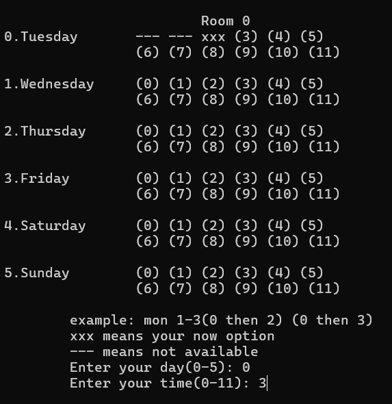

# karoke_system
This is university assignment. It is a C++ project that let user able to book and cancel time slot of karoke. 
It saves data in txt file. So, it will keep the data if program is restarted.
It will create txt file if needed txtfile is not exists.

* [Startig page](#startpage)
* [Home page](#homepage)
* [Sign up page](#signup)
* [Login page](#login)
* [User page](#userpage)
  * [Room selection page](#roomselection)
  * [Timeslot booking page](#timeslotbooking)
  * [Receipt](#receipt)
  * [Cancel reservation page](#cancelpage)
* [Profile](#profile)

  
 1. This is start page of this program.

  

  
 1.This is home page which provide login, signup and profile choice.

  

  
 1. This is signup page of this program.

  
 2. User will need to key in their name, IC no and phone number for sign up an account.

  
 3. The account will only be created if value are correct and does not exists in system. 

  
 4. System will create a txt file when account created successfully. 

  

  
1. This is login page of this program.

  
2.  User will need to key in their name, IC no and phone number to login to their account.

  
3.  System will search the txt file by the name provided. 

  

  
1. This is user page which provide book and cancel choice to user.

  

  
1. This is room selection page.

  
2. User able to choose the room which have the desired time for them. 

  
3. Then user need to confirm the selection. 

  
  

  
1. This is timeslot booking page

  
2. User will need to enter day and time

  
3. If user need more time, they can back to this page and select more timeslot. 

  

  
1. This is receipt of the bill 

  
2. It shows user details, booked day and timeslot

  
3. Once completed, system will update the room information txt file and user information txt file.

  

  
1. This is cancel reservation page 

  
2. User will need to key in the index of timeslot and confirm 

  
3. Once confirmed, system will update the room information txt file and user information txt file.

  

  
1. This is profile page 

  
2. It shows user details, booked day and timeslot

  

